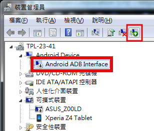
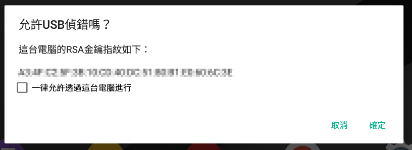

# Node

* [node.js](https://nodejs.org/en/)
* Cordova
  * `npm i -g cordova@6.5.0`

# Android

* from [Visual Studio](https://www.visualstudio.com/zh-hant/vs/cordova/?rr=https%3A%2F%2Fwww.google.com.tw%2F)
* [Visual Studio TACO](https://taco.visualstudio.com/en-us/docs/get-started-first-mobile-app/)

## Environment

* `ANDROID_HOME`: `PATH_TO/Android/android-sdk`
* `PATH` add:
  * `%ANDROID_HOME%\platform-tools`
  * `%ANDROID_HOME%\tools`
  * `%ANDROID_HOME%\tools\bin`

## SDK

1. open `SDK Manager` in `Android\android-sdk`
2. install
    * `Extras`
    * `Tools\Android SDK Platform-tools`
    * `Tools\Android SDK Tools`
    * `Android 7.1.1 (API 25)`

## USB Driver

for [Chrome inspect](https://developers.google.com/web/tools/chrome-devtools/remote-debugging/) (`chrome://inspect/`)

Ref: [Android Driver](http://j796160836.pixnet.net/blog/post/29610725-%5Bandroid%5D-google%E5%87%BA%E7%9A%84android%E8%90%AC%E7%94%A8%E9%A9%85%E5%8B%95%EF%BC%8C%E9%A9%85%E5%8B%95%E8%A3%9D%E4%B8%8D%E4%B8%8A)

1. [open `裝置管理員`](https://technet.microsoft.com/zh-tw/library/cc754081(v=ws.11).aspx#bkmk_2)
    * `mmc devmgmt.msc`
2. update `ADB Interface` choose `PATH_TO\Android\android-sdk\extras\google\usb_driver`





## Gradle Proxy

for error: `Downloading https://services.gradle.org/distributions/gradle-2.14.1-all.zip`

Ref: [gradle build environment](https://docs.gradle.org/current/userguide/build_environment.html)

```
systemProp.http.proxyHost=IP
systemProp.http.proxyPort=PORT
systemProp.https.proxyHost=IP
systemProp.https.proxyPort=PORT
```

* in user folder
  * `C:\Users\<USER_NAME>\.gradle\gradle.properties`
* in project folder
  * `CORDOVA_PROJECT_ROOT\platforms\android\gradle.properties`
