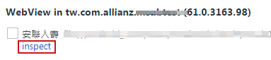

# Steps

1. Install Node.js from [Official Website](https://nodejs.org/en/)
2. Install Cordvoa
    * `npm i -g cordova@6.5.0`
3. Install JAVA
    * `C:\Users\Administrator\AppData\LocalLow\Oracle\Java\jdk1.8.0_66_x64\jdk1.8.0_66.msi`
4. Install Android
    * from [Visual Studio Tools for Apache Cordova](https://msdn.microsoft.com/zh-tw/library/dn757054.aspx)
5. Install Android SDK
    * from `C:\Program Files (x86)\Android\android-sdk\SDK Manager.exe`
      * set proxy from `Tools -> Options...`
        * HTTP Proxy Serve: `IP`
        * HTTP Proxy Port: `Port`
    * Choose:
      * `Extras`
      * `Tools\Android SDK Platform-tools`
      * `Tools\Android SDK Tools`
      * `Android 7.1.1 (API 25)`
6. [USB Driver](http://j796160836.pixnet.net/blog/post/29610725-%5Bandroid%5D-google%E5%87%BA%E7%9A%84android%E8%90%AC%E7%94%A8%E9%A9%85%E5%8B%95%EF%BC%8C%E9%A9%85%E5%8B%95%E8%A3%9D%E4%B8%8D%E4%B8%8A)
    1. [open `裝置管理員`](https://technet.microsoft.com/zh-tw/library/cc754081(v=ws.11).aspx#bkmk_2)
        * `mmc devmgmt.msc`
    2. update `ADB Interface` choose `C:\Program Files (x86)\Android\android-sdk\extras\google\usb_driver`
7. Environment Setting
    * `ANDROID_HOME`: `C:\Program Files (x86)\Android\android-sdk`
    * `PATH` add:
      * `%ANDROID_HOME%\platform-tools`
      * `%ANDROID_HOME%\tools`
      * `%ANDROID_HOME%\tools\bin`
8. Gradle Proxy
    * for error: `Downloading https://services.gradle.org/distributions/gradle-2.14.1-all.zip`
    * Ref: [gradle build environment](https://docs.gradle.org/current/userguide/build_environment.html)
    * in user folder
      * `C:\Users\<USER_NAME>\.gradle\gradle.properties`
    * in project folder
      * `CORDOVA_PROJECT_ROOT\platforms\android\gradle.properties`
    * Setting:
      ```
      systemProp.http.proxyHost=IP
      systemProp.http.proxyPort=PORT
      systemProp.https.proxyHost=IP
      systemProp.https.proxyPort=PORT
      ```
9. Enabled ADB Interface
    1. [open `裝置管理員`](https://technet.microsoft.com/zh-tw/library/cc754081(v=ws.11).aspx#bkmk_2)
        * `mmc devmgmt.msc`
    2. Right click `Android ADB Interface` and click `啟用`
        * 
    3. Until device show and click `確定`
        * 
10. Run Project to device
    * `cd TO/PROJECT/ROOT/FOLDER`
    * `npm run run:and`
      * (or run `cordova prepare android` and  `cordova run android --device`)
11. [Chrome Inspect](https://developers.google.com/web/tools/chrome-devtools/remote-debugging/)
    * `chrome://inspect/`
        * 
